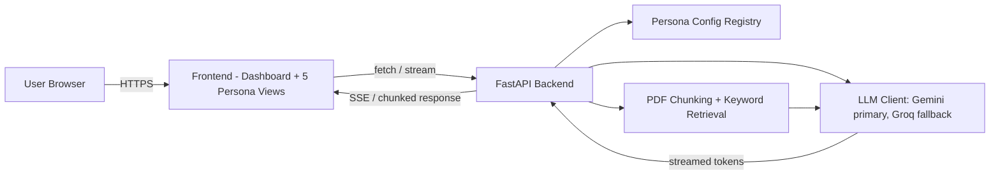

# Architecture — AI Command Center

## 1. Architecture Overview

One backend, one frontend shell, five persona configurations. The system is deliberately NOT five separate services — that would multiply Docker/AWS complexity for a 5-day timeline with no real benefit. Instead, personas are data (config objects), and the routing/streaming/LLM-calling logic is shared code written once.



## 2. Backend Architecture (FastAPI)

Suggested folder structure:

```
backend/
  app/
    main.py                 # FastAPI app, CORS, route mounting
    routers/
      chat.py                # POST /api/chat/{persona_id} - streaming endpoint
      upload.py              # POST /api/upload - PDF upload for Document Analyzer / Research Assistant
    personas/
      registry.py            # dict of persona_id -> PersonaConfig
      study_mentor.py
      code_reviewer.py
      document_analyzer.py
      resume_reviewer.py
      research_assistant.py
    core/
      llm_client.py           # Gemini call + Groq fallback + streaming
      retrieval.py            # chunking + keyword scoring for Document Analyzer / Research Assistant
      config.py                # env var loading
    models/
      schemas.py              # Pydantic request/response models
  Dockerfile
  requirements.txt
```

### 2.1 Persona config pattern

Each persona is a plain config object, not a separate service:

```python
class PersonaConfig(BaseModel):
    id: str
    display_name: str
    system_prompt: str
    output_mode: Literal["freeform", "json_schema"]
    requires_upload: bool = False
    schema: dict | None = None   # only for json_schema personas
```

`registry.py` maps `persona_id -> PersonaConfig`. The `/api/chat/{persona_id}` route looks up the config, builds the message payload, and calls the shared LLM client — identical code path for all five personas. Only the config differs.

### 2.2 LLM client (Gemini primary, Groq fallback)

```python
async def call_llm_stream(messages, persona_config):
    try:
        async for chunk in call_gemini_stream(messages):
            yield chunk
    except (GeminiRateLimitError, GeminiTimeoutError, GeminiServerError):
        async for chunk in call_groq_stream(messages):
            yield chunk
```

Fallback triggers on rate-limit, timeout, or 5xx from Gemini — not on content-based errors (those should surface to the user, not silently retry on a different model).

### 2.3 Streaming

Use Server-Sent Events (SSE) or a chunked HTTP response from FastAPI (`StreamingResponse`). The frontend consumes it with `fetch` + `ReadableStream` (or `EventSource` if using SSE) and appends tokens to the UI as they arrive.

## 3. Frontend Architecture (recommended: React — pending team confirmation)

```
frontend/
  src/
    App.jsx                   # routing
    pages/
      Dashboard.jsx            # persona selection cards
      StudyMentor.jsx
      CodeReviewer.jsx
      DocumentAnalyzer.jsx
      ResumeReviewer.jsx
      ResearchAssistant.jsx
    components/
      ChatStream.jsx            # shared streaming chat UI, reused across personas
      FileUpload.jsx             # shared upload component (Document Analyzer, Research Assistant)
      StructuredOutput.jsx       # renders JSON-schema personas (Code Reviewer, Resume Reviewer) as categorized cards
    api/
      client.js                  # fetch wrapper + stream reader
```

Shared components (`ChatStream`, `FileUpload`, `StructuredOutput`) do most of the work; each persona page is a thin wrapper that points them at the right endpoint and renders persona-specific labels/instructions.

## 4. Persona-Specific Notes

### 4.1 Document Analyzer retrieval pipeline
1. On upload: extract text (e.g. `pypdf`), split into chunks of ~300–500 words with ~50-word overlap
2. On question: tokenize the question, score each chunk by keyword/token overlap (simple term-frequency scoring — no embeddings)
3. Take top-k (e.g. top 4) scoring chunks, inject into the prompt as labeled excerpts
4. Persona system prompt instructs the model to answer only from those excerpts and say so explicitly if the answer isn't present

### 4.2 Research Assistant multi-source handling
Accepts both PDF uploads and pasted text blocks as sources. Each source is chunked the same way as Document Analyzer, but instead of retrieving top-k chunks for a single question, all sources' key content is passed together with source labels (Source 1, Source 2, ...) so the model can synthesize and cross-reference explicitly.

## 5. Request Lifecycle (typical chat persona)

1. User sends message from a persona view
2. Frontend POSTs to `/api/chat/{persona_id}` and opens a stream reader
3. Backend loads the persona config, builds messages (system prompt + history + user input, plus retrieved context if applicable)
4. Backend calls `call_llm_stream` (Gemini, falling back to Groq)
5. Tokens stream back to the frontend as they're generated
6. Frontend appends tokens to the UI in real time

## 6. Containerization

Single Docker image: FastAPI serves the API routes AND the frontend's built static files (e.g. React build output copied into a `static/` folder and served via FastAPI's `StaticFiles`). This keeps deployment to one container instead of coordinating two.

```dockerfile
# Simplified sketch — flesh out during Day 4
FROM node:20 AS frontend-build
WORKDIR /frontend
COPY frontend/ .
RUN npm install && npm run build

FROM python:3.12-slim
WORKDIR /app
COPY backend/ .
COPY --from=frontend-build /frontend/dist ./static
RUN pip install -r requirements.txt
CMD ["uvicorn", "app.main:app", "--host", "0.0.0.0", "--port", "8080"]
```

## 7. AWS Deployment Architecture (recommended: App Runner — pending team confirmation)

- Push the Docker image (via ECR or directly from a GitHub-connected build)
- App Runner service configured with env vars: `GEMINI_API_KEY`, `GROQ_API_KEY`, plus any others
- App Runner provides the public HTTPS URL automatically (no manual TLS setup needed)
- Set AWS Budget Alerts (e.g. at $1 and $5 thresholds) immediately after account/service setup, before heavy usage begins

Elastic Beanstalk is the fallback option if App Runner has team-specific issues — it requires more manual configuration (environment, load balancer) but offers more control.

## 8. Security Architecture

- All API keys loaded via environment variables (`os.environ`), never hardcoded
- `.env` file added to `.gitignore` from day one
- CORS configured to allow only the deployed frontend origin (and localhost during dev)
- Basic input validation on upload size/type (PDF only, reasonable size cap) to avoid abuse
- No user-identifying data stored beyond the active session

## 9. Open Decisions

- Frontend framework: React (recommended) vs. plain HTML/CSS/JS — confirm at team meeting
- AWS deployment target: App Runner (recommended) vs. Elastic Beanstalk — confirm at team meeting
