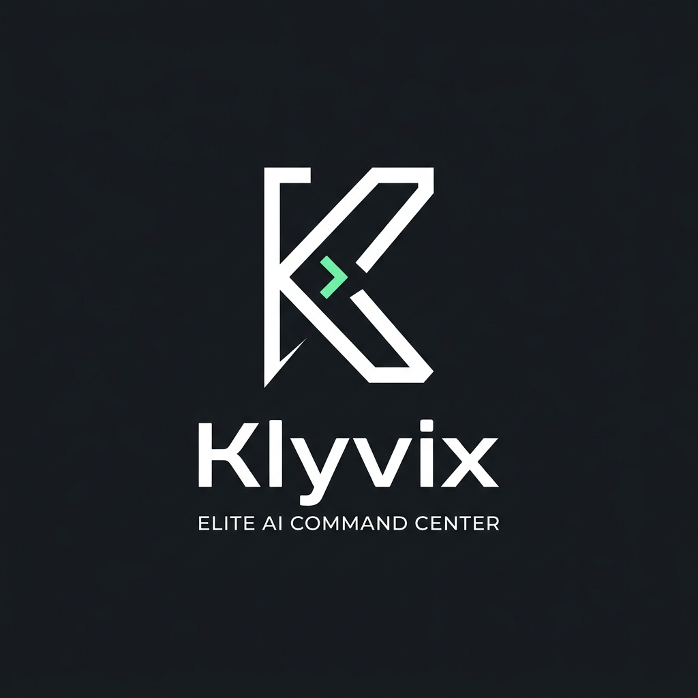
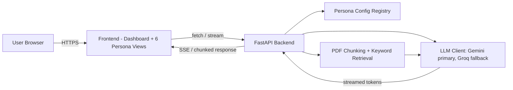

# HexaMind: Project Report

<p align="center">
  
</p>

**Project**: Vibe Coding Final Project — Gen AI & Cloud Computing
**Team size**: 6 
**Timeline**: 5 days

---

## 1. Overview & Tech Stack

HexaMind is a unified, high-performance platform housing 6 specialized AI personas, each engineered for specific academic and professional workflows. Instead of one generic chatbot reused with different names, each persona has its own prompt design, behavior rules, and output structure.

### Tech Stack
*   **Backend**: FastAPI (Python) - Chosen for its native async support and ease of implementing Server-Sent Events (SSE) for streaming responses.
*   **Frontend**: Vanilla HTML/CSS/JS - A deliberate choice to maintain zero build step, maximum control, and a lightweight footprint while delivering a custom terminal-inspired UI.
*   **Primary LLM**: Google Gemini API - Selected for high-quality reasoning and robust performance.
*   **Fallback LLM**: Groq API (Mixtral/Llama) - Integrated for ultra-fast inference and automatic fallback when Gemini rate-limits or experiences downtime.
*   **Deployment**: AWS App Runner - Used for deploying a single Docker container, providing automatic HTTPS and easy scaling within free-tier limits.

---

## 2. Prompting Strategy

The core engineering differentiation in HexaMind lies in our prompting strategy. We moved beyond cosmetic character personas to functional, workflow-specific AI agents.

### Key Strategies
*   **Role-Based Constraints**: Each prompt strictly defines what the AI *must* do and *must not* do.
*   **Output Modes**: We utilize both freeform conversational modes and strict JSON schema outputs, rendered gracefully by the frontend.
*   **Grounding**: The Document Analyzer is explicitly prompted to *only* use provided context and refuse to answer if the information is missing.

### Sample Prompts

**1. Study Mentor (Socratic Mode)**
> "When the user wants guided learning: 1. Incremental Disclosure: Break concepts into 2-3 digestible pieces. Introduce one, then pause. 2. Check Understanding: After each piece, ask a specific open-ended question. 3. Adaptive Pacing: Accelerate if they answer correctly, slow down if they struggle."

**2. Code Reviewer (JSON Schema Mode)**
> "Respond STRICTLY as valid JSON matching this schema (no additional text before or after)... [Schema defining language, bugs, security, performance, style, and summary]"

**3. Code Colleague (Collaborative Mode)**
> "NEVER expose your internal process, step numbers, or instruction labels in your responses... Support rapid refactoring cycles: When the user asks for changes, apply them surgically without rewriting everything. Preserve what's working; only modify what needs to change."

*(Full prompt designs are documented in `prompt-design.md`)*

---

## 3. Architecture

HexaMind uses a monolithic but highly modular architecture. Personas are treated as configuration data rather than separate microservices.



**Key Architectural Decisions:**
1.  **Config-Driven Personas**: `registry.py` defines each persona. The `/api/chat/{persona_id}` route uses identical code for all personas, altering behavior solely based on the config.
2.  **Streaming First**: All LLM interactions use streaming (SSE) to ensure a fast time-to-first-token (TTFT).
3.  **Intelligent Fallback**: The backend catches `GeminiRateLimitError` or `5xx` errors and seamlessly retries the request using the Groq API, transparently to the user.

---


## 4. Challenges & Fixes

**Challenge 1: Document Hallucinations**
*   *Issue*: Early versions of the Document Analyzer would supplement missing information from its training data.
*   *Fix*: We implemented a strict prompt constraint ("If the answer is NOT in the document, say plainly: 'I couldn't find this in the document'") and ensured the injected context was clearly delineated.

**Challenge 2: Structured Output Parsing**
*   *Issue*: The LLM would occasionally wrap JSON output in markdown blocks (e.g., ` ```json ... ``` `), breaking the JSON parser.
*   *Fix*: Implemented robust pre-processing on the backend to strip markdown code blocks before parsing the JSON response.

**Challenge 3: UI Aesthetic Consistency**
*   *Issue*: Transitioning to a strict "Elite Terminal" look was difficult while maintaining usability (e.g., icons, buttons).
*   *Fix*: Stripped all SVGs and emojis, replacing them with pure ASCII characters (`[>_]`, `[*]`, `$`) and implemented a custom `terminal-processing` blinking indicator to maintain the vibe coding aesthetic.

---

## 5. Key Learnings

1.  **Prompt Engineering is Software Engineering**: Crafting robust prompts requires the same rigor as writing code—handling edge cases, defining schemas, and iterative testing.
2.  **Streaming is Essential for UX**: Waiting 10 seconds for a full response breaks the illusion of a conversational agent. SSE streaming makes the app feel instantly responsive.
3.  **Personas as Data**: Architecting the personas as configuration objects saved us days of duplicated routing and API integration work.
4.  **Fallback Mechanisms**: Relying on a single LLM provider is risky for a production app. Implementing a transparent fallback (Gemini to Groq) proved invaluable during development rate limits.
